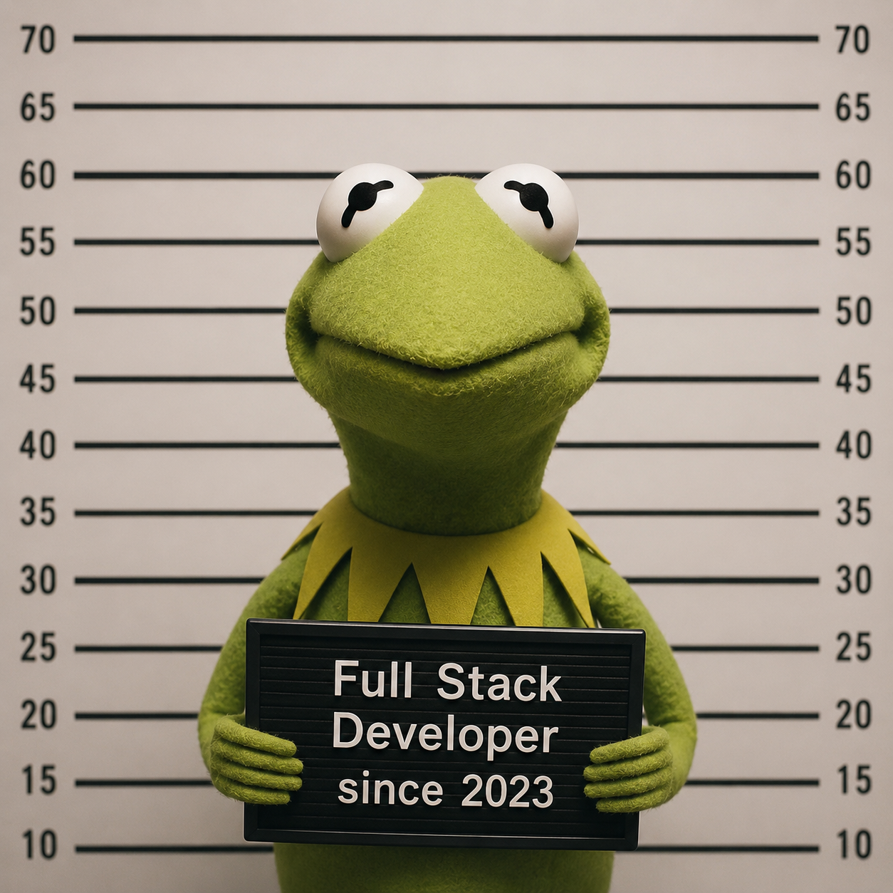

<div align="center">



<h1>Hi, I'm Hung Nguyen 👋</h1>
<h3>Full-stack Developer | Product-minded Builder</h3>

<p>
  I build end-to-end web applications with a focus on clean interfaces,
  reliable backend logic, readable code, and real-world deployment workflows.
  <br />
  I enjoy turning ideas into usable products, from frontend UI and user experience
  to API design, database structure, authentication, and production deployment.
</p>

<p>
  <strong>Current Quest:</strong> Building practical full-stack applications,
  improving system design, and creating better user experiences through real projects.
</p>

</div>

---

## Tech Stack

<table>
  <tr>
    <td align="center" width="70">
      
    </td>
    <td align="center" width="70">
      
    </td>
    <td align="center" width="70">
      
    </td>
    <td align="center" width="70">
      
    </td>
    <td align="center" width="70">
      
    </td>
    <td align="center" width="70">
      
    </td>
  </tr>
  <tr>
    <td align="center" width="70">
      
    </td>
    <td align="center" width="70">
      
    </td>
    <td align="center" width="70">
      
    </td>
    <td align="center" width="70">
      
    </td>
    <td align="center" width="70">
      
    </td>
    <td align="center" width="70">
      
    </td>
  </tr>
</table>

---

## Languages and Tools

<table>
  <tr>
    <td align="center" width="70">
      
    </td>
    <td align="center" width="70">
      
    </td>
    <td align="center" width="70">
      
    </td>
    <td align="center" width="70">
      
    </td>
    <td align="center" width="70">
      
    </td>
    <td align="center" width="70">
      
    </td>
  </tr>
</table>

---

## Featured Projects

<table>
  <tr>
    <td width="60" align="center" valign="middle">
      
    </td>
    <td valign="middle">
      <strong>Questly</strong>
      <br />
      <sub>
        A gamified learning RPG platform with flashcards, dungeon exploration,
        and turn-based combat.
      </sub>
      <br />
      <sub>
        <strong>Stack:</strong> NextJS / TypeScript / Node.js / MongoDB / Tailwind CSS
      </sub>
    </td>
  </tr>
  <tr>
    <td width="60" align="center" valign="middle">
      
    </td>
    <td valign="middle">
      <strong>Productivity App</strong>
      <br />
      <sub>
        A mobile-focused productivity app for tasks, projects, schedules,
        focus sessions, and team collaboration.
      </sub>
      <br />
      <sub>
        <strong>Stack:</strong> Flutter / Firebase or Backend API
      </sub>
    </td>
  </tr>
</table>

---

## Dev Quest Board

<table>
  <tr>
    <td align="center" width="160">
      <strong>Current Level</strong>
      <br />
      <sub>Full-stack Learner</sub>
    </td>
    <td align="center" width="160">
      <strong>Main Quest</strong>
      <br />
      <sub>Build real products</sub>
    </td>
    <td align="center" width="160">
      <strong>Side Quest</strong>
      <br />
      <sub>Improve UI/UX</sub>
    </td>
  </tr>
  <tr>
    <td align="center">
      <strong>Favorite Stack</strong>
      <br />
      <sub>NextJS + Tailwind</sub>
    </td>
    <td align="center">
      <strong>Learning</strong>
      <br />
      <sub>Backend & Deployment</sub>
    </td>
    <td align="center">
      <strong>Status</strong>
      <br />
      <sub>Building...</sub>
    </td>
  </tr>
</table>

---

## GitHub Stats

<div align="center">


<br />


<br />


</div>

---

## Currently Working On

```txt
> npm run dev

[Quest] Building better user experiences
[Focus] Frontend, full-stack workflows, deployment
[Status] Learning by building real projects
````

---

<div align="center">

### Thanks for visiting my profile.

<sub>Code. Build. Debug. Repeat.</sub>

</div>
```
